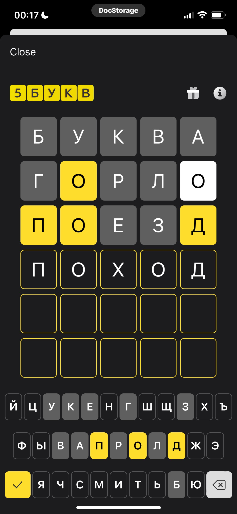

# Find Word

This is a simple command-line application written in JavaScript that helps you find 5 letter words. It was hastly made for fun to play **"5 letters"** game by **Tinkoff**. It reads a list of words from a file, and then prompts you for three types of input:

1. Letters that should be in the word
2. Letters that should not be in the word
3. A regular expression that the word should match

The application then filters the list of words based on these criteria and prints the matching words to the console.

## Installation

You need to have Node.js installed to run this application. Once you have Node.js installed, follow these steps:

1. Clone this repository to your local machine.
2. Navigate to the directory containing the repository.
3. Run npm install to install the necessary dependencies.

## Usage

 To run the application, use the following command:

```bash
npm start
```

You will then be prompted to enter the letters that should be in the word, the letters that should not be in the word, and a regular expression that the word should match. After you have entered these criteria, the application will print the matching words to the console.

## Real game example

```bash
5letters $ npm start

> 5letters@1.0.0 start
> node find_word.js

? Есть буквы: 
? Нет букв: буква
? Регулярное выражение: .....
Возможные слова:
[
  'Аггей', 'Адель', 'Алфея', 'Ампер', 'Антип', 'Антон', 'Артём',
  'Архип', 'Бойль', 'Борей', 'Борис', 'Вилен', 'Волго', 'гелий',
  'Гелий', 'гелио', 'гемин', 'генез', 'гений', 'Гения', 'генно',
  'генно', 'геном', 'генри', 'генри', 'генри', 'геоид', 'герой',
  'гетры', 'гетто', 'гёрлс', 'гётит', 'гигро', 'гидро', 'гилея',
  'гинея', 'гипер', 'Гипро', 'гипюр', 'гирло', 'гисто', 'глинт',
  'глядь', 'глядя', 'глясе', 'гнейс', 'гниль', 'гнить', 'гогот',
  'гожий', 'голем', 'голец', 'голод', 'голос', 'голый', 'голыш',
  'гольё', 'гольф', 'гольф', 'гольф', 'гольф', 'гомон', 'гонды',
  'гонец', 'гонит', 'гонор', 'горец', 'горец', 'горло', 'гормя',
  ... 1368 more items
]
5letters $ npm start

> 5letters@1.0.0 start
> node find_word.js

? Есть буквы: о
? Нет букв: буквагрл
? Регулярное выражение: .о..[^о]
Возможные слова:
[
  'дождь', 'доить', 'дойти', 'домен', 'домой', 'донос',
  'донце', 'донцы', 'донья', 'досье', 'дофин', 'доход',
  'доход', 'Зосим', 'ионий', 'Иосиф', 'йомен', 'Конон',
  'модем', 'модем', 'модий', 'момме', 'момот', 'моном',
  'монте', 'Монте', 'мопед', 'мосье', 'мотет', 'мотня',
  'ножны', 'нойон', 'нонет', 'нонче', 'нотис', 'ночью',
  'Ноэми', 'ооцит', 'подий', 'поезд', 'пожня', 'позём',
  'позже', 'поить', 'поить', 'пойнт', 'пойти', 'помёт',
  'помин', 'помои', 'понос', 'понюх', 'посох', 'потом',
  'потоп', 'поход', 'почём', 'почёт', 'почин', 'почти',
  'Созон', 'сойти', 'сомит', 'сомон', 'сомон', 'сонет',
  'сосед', 'сосцы', 'сотня', 'сотый', 'софит', 'София',
  'Софон', 'Софья', 'тодес', 'тойон', 'томми', 'топот',
  'топче', 'тотем', 'тощее', 'тощий', 'фондю', 'фонон',
  'Фотий', 'фотон', 'ходом', 'ходче', 'хохот', 'чомпи',
  'чохом', 'шоссе', 'эозин', 'эоцен'
]
5letters $ npm start

> 5letters@1.0.0 start
> node find_word.js

? Есть буквы: под
? Нет букв: буквагрлез
? Регулярное выражение: по..д
Возможные слова:
[ 'поход' ]
```


